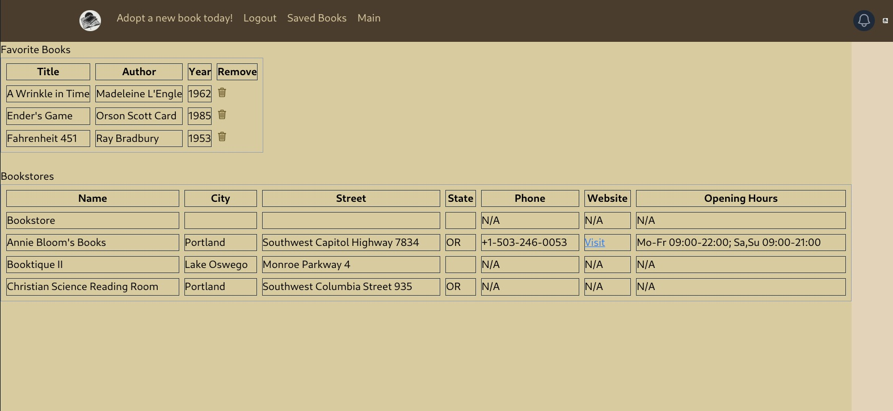

# Book Shelter 

## Description

Book Shelter presents a random book and the option to save it to a favorites shopping list. Use the locate local booksellers list to support their business.

## Table of Contents

- [Installation](#installation)
- [Usage](#usage)
- [License](#license)
- [Contributing](#contributing)
- [Tests](#tests)
- [Questions](#questions)

## Installation

1. Change to the project's root directory
1. Create the PostgreSQL database
   - Create a server/.env containing your PostgreSQL admin credentials and a random JWT password (refer to the .env.EXAMPLE located there).
   - Use psql to import the server/db/schema.sql (e.g. psql -U postgres -f db/schema.sql)
1. Install the dependency modules: npm install
1. Build the server and seed the database:
   - npm run server:build
   - npm run seed

## Usage

NOTE: The application requires access to your system location in order to locate bookstores near you

1. Change to the project's root directory
1. Run: npm run dev
1. Browse to the running app at: http://localhost:3000/

- See the active Book Shelter site deployed on Render [here](https://bookshelter.onrender.com/)  
  Note that it takes a couple of minutes to spin up!  
     
  See the Presentation slides located at client/src/assets/slides/BookShelter Presentation.pptx  
  

## License

This application is covered under the [MIT](https://opensource.org/licenses/MIT) license

## Contributing

Guidelines:  
Ensure your code follows the project's coding standards.  
Write clear and concise commit messages.  
If your changes include new features, please update the documentation accordingly.  
If you are fixing a bug, please include a test to verify the fix.  
Thank you for your contributions!
Here are some helpful resources:  
  
  
  

## Tests

Test instructions:

1. Try logging in with valid credentails (available in the server/src/seeds/user-seeds.ts file)
1. Try logging in with invalid credentails: expect an error message
1. Try using the reject and save buttons on the main page.
1. On the saved favorites page ensure the list is updated with the items you added on the main page.
1. Try removing books until the list is empty.
1. Ensure the shop locations list is populated
1. Logout. Ensure that you are unable to access any of the Book Shelter pages
1. Login and leave the page open an hour or longer for the JWT token to expire (or remove the id_token from your localStore). Ensure that you are unable to access any of the Book Shelter pages, and if you click on any actions you are redirected to the login page

## Questions

If you have any questions, feel free to reach out to us:

- Andrew Gnemi

  - GitHub: [agnemi](https://github.com/agnemi)
  - Email: a.j.gnemi@gmail.com

- Clint Jones

  - GitHub: [clintsrc](https://github.com/clintsrc)
  - Email: clinton.alan.jones@gmail.com

- Gavin Stockwell
  - GitHub: [Gavin-Scot-Stockwell](https://github.com/Gavin-Scot-Stockwell)
  - Email: gsstockwell@gmail.com
